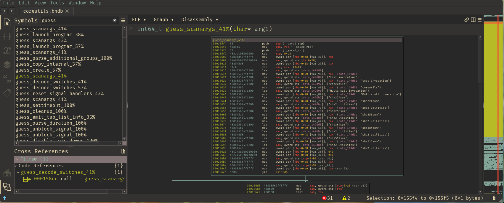

# Symstress

Symstress is a tool to attempt to recover symbols in a binary given a set of source files
that the binary is suspected to be compiled from.

For example, the Realworld CTF 2022 competition had a challenge called "FLAG", where
players were given a stripped compiled binary but were told it used LWIP, RTOS, and some
other open source projects.

The motivating example is the inclusion of LWIP in the binary, a full TCP/IP stack that
is readily available and whose version number was easy to find with a small amount of
static analysis (in Binary Ninja).

Instead of some similar tools which attempt to do this using a second binary that is
compiled with symbols to populate symbols in the target binary, this is done using the
tree sitter parsing library's Python bindings.

## Example

The tool will create a BNDB that when opened looks something like this:



## Installation

```sh

git clone https://github.com/novafacing/symstress.git
cd symstress
git submodule init
git submodule update
poetry install
poetry shell
python3 /path/to/binaryninja/scripts/install_api.py -v
python3 -c 'import binaryninja'
```

## Usage

```
❯ python3 -m symstress --help
usage: symstress [-h] [--binary BINARY] [--backend {binaryninja}] [--match MATCH] [--options OPTIONS] [--prefix PREFIX] [--include-confidence] source

positional arguments:
  source                The source directory to acquire symbols for.

optional arguments:
  -h, --help            show this help message and exit
  --binary BINARY       The binary to add symbols to.
  --backend {binaryninja}
                        The backend to add symbols in.
  --match MATCH         The minimum similarity of a symbol to add to the binary.
  --options OPTIONS     Options to pass to BinaryViewType.get_view_of_file_with_options().
  --prefix PREFIX       The prefix to add to the symbol name.
  --include-confidence  Include the confidence of a match in the output.
```

Something like:

```
python3 -m symstress --binary test/binaries/coreutils --backend binaryninja ~/Downloads/coreutils-master/src
``` 
will create a `.bndb` file with pre-populated guesses as to what functions are named what!

The optional `--prefix` option is very useful for differentiating what symbols were populated by symstress. For example, we can do:

```
python3 -m symstress --binary test/binaries/coreutils --backend binaryninja --prefix 'guess_' ~/Downloads/coreutils-master/src
```
